# Chatbot brain: handover context

> **Who this is for.** The next owner of the GeoDin website chatbot's knowledge. Leonard holds this folder and passes it on. It explains how the chatbot's "brain" (the markdown files in this repo) is built and kept up to date, so someone new can pick it up without the original author around.
>
> Written by Nuno Ferreira at handover, October 2026.

## Read this first

1. **The chatbot reads this repo live.** Whatever is on `main` is what the bot knows. Merge a change and the next conversation uses it. Nothing needs to be copied into n8n.
2. **There are two layers, owned by different people.** The *knowledge* (this repo) is edited here. The *system prompt and plumbing* (tools, memory, CRM and email actions) live inside n8n and belong to the n8n owner. `System_Prompt.md` in this repo is an **old reference copy**. Editing it changes nothing.
3. **You don't need any automation to maintain it.** Editing a file through a pull request is enough. The automated pipeline described below just made it cheaper to keep up with changes on the website and docs.
4. **The upstream pipeline does not come with this repo.** The scrapers and source folders that fed the brain lived on the author's machine and are gone. [`rebuild-prompts.md`](rebuild-prompts.md) has the instructions to rebuild them with an AI coding assistant, if you want the automation back.

## How the chatbot works

```mermaid
flowchart LR
    subgraph Sources["Upstream sources (rebuild yourself)"]
        S1[docs.geodin.com]
        S2[geodin.com + Autodesk Marketplace]
        S3[Anonymized call transcripts]
        S4[Hand-curated notes:<br/>competitors, partners,<br/>published articles]
    end

    subgraph Repo["This repo (main branch)"]
        B[13 brain files<br/>Part1_* / Part2_*]
        C[Central_Reference.md<br/>routing + rules + overrides]
    end

    subgraph N8N["n8n (owned by the n8n owner)"]
        M["'MCP github' workflow<br/>one GitHub tool per file"]
        A[AI Agent node<br/>live system prompt, memory,<br/>CRM / email tools]
    end

    V((Website visitor))

    Sources -- "refresh: detect changes,<br/>propose edits, open PR" --> Repo
    Repo -- "read live on every chat" --> M
    M --> A
    A <--> V
```

**At runtime.** A visitor asks something on geodin.com. The AI Agent in n8n opens `Central_Reference.md`, which tells it which brain file covers that topic. It then calls the matching tool in the **"MCP github"** workflow. Each tool fetches exactly one file from `main` on GitHub, and the agent answers from what comes back.

**At maintenance time.** Someone notices new knowledge (a release, a pricing change, a new competitor insight) and edits the right brain file in a PR. When the PR is merged, the bot picks it up.

## What's in this repo

| File | Role | Edit? |
|---|---|---|
| `Part1_KnowledgeBase_*.md` (4) | Facts: products, value proposition and personas, credibility, competitors | Yes |
| `Part2_ChatbotIntel_*.md` (9) | Behaviour and Q&A: technical and commercial Q&A, pricing rules, qualification, routing links, tone, ecosystem | Yes |
| `Part2_ChatbotIntel_Guardrails.md` | What the bot must never do | **Only by hand, deliberately** |
| `Part2_ChatbotIntel_Handoff_Protocol.md` | When and how to escalate to a human | **Only by hand, deliberately** |
| `Central_Reference.md` | Routing index (§1), rules that always apply (§2), dated overrides (§5). The bot reads it before answering | Yes, carefully. It affects every answer |
| `System_Prompt.md` | Old copy of the n8n prompt | **No.** Reference only |
| `INDEX.md` | Table of contents | Keep it in sync |

`INDEX.md` has a one-line description of every brain file.

## Where does a change go?

| You want to… | Edit |
|---|---|
| Add or correct a fact (feature, price, release, competitor detail) | The matching `Part1_*` / `Part2_*` file |
| Change a rule that applies everywhere (tone, how to treat competitors, a pricing policy, when to ask for an email) | `Central_Reference.md` §2 |
| Make a change take effect right away and override older text, without rewriting several files | Add a dated entry to `Central_Reference.md` §5 |
| Change which file answers which topic | `Central_Reference.md` §1 |
| Change the prompt, tools, memory, CRM or email behaviour, or the model | **n8n.** Ask the n8n owner |

## Hard rules (and why)

- **Never add, rename or delete a brain file.** Each file is wired to its own named tool in the "MCP github" n8n workflow. A renamed file breaks that tool without any error, and the bot loses that topic. If the file set really has to change, change n8n at the same time, together with the n8n owner.
- **Work only through pull requests, never by pushing to `main`.** `main` is production.
- **Guardrails and Handoff Protocol are edited only on purpose**, never as part of a routine refresh.
- **Show the full diff for `Part2_ChatbotIntel_Pricing_Rules.md` and `Central_Reference.md`** before merging. Pricing is sensitive, and Central Reference touches every answer.
- **Fix every copy of a fact.** The most common failure was correcting a fact in one file and leaving an old duplicate in another (Civil 3D versions, Onsite pricing, standards lists). Before merging, search the whole repo for the fact you changed.
- **This repo is public.** Never commit n8n workflow exports, credentials, customer names, conversation transcripts or internal-only pricing. The n8n exports are git-ignored on purpose.

## Who owns what (October 2026)

| Area | Owner |
|---|---|
| n8n workflows, live system prompt, tool wiring | Edu (n8n) |
| Website and chatbot access | Rik |
| This repo and the handover context | Leonard, until a new knowledge owner is named |

## Open items at handover

- **Onsite licensing wording is out of date.** geodin.com/pricing has sold Onsite **per user seat** since September 2026, but several brain files still say "per device" (`Part1_KnowledgeBase_ProductSuite.md`, `Part1_KnowledgeBase_ValueProposition_Personas.md`, and the competitor comparisons in `Part1_KnowledgeBase_CompetitivePositioning.md`). The "per device beats per user" competitor argument needs to come out too. This is a good first PR for the new owner.
- **`System_Prompt.md` is out of sync** with the live prompt in n8n. Either ask the n8n owner for a fresh export of the prompt text (no credentials) or delete the file. Just don't edit it as if it were live.
- **The German support site (support.geodin.com) has never been a source** for the brain. It might be worth adding.

## Files in this folder

| File | What it gives you |
|---|---|
| `README.md` | This overview |
| [`how-to-update.md`](how-to-update.md) | Step-by-step: the manual way (enough for most changes) and the automated refresh cycle the author ran weekly |
| [`rebuild-prompts.md`](rebuild-prompts.md) | Copy-paste prompts for an AI coding assistant to rebuild the scrapers, transcript pipeline and refresh workflow in your own environment |
