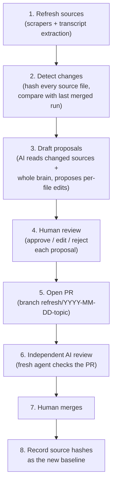

# How to update the chatbot brain

There are two ways to do it. **Option A** is all you need for occasional changes. **Option B** is the weekly cycle the original author ran to keep up with the website, docs and customer calls. You only need it if you rebuild the pipeline in [`rebuild-prompts.md`](rebuild-prompts.md).

Read [`README.md`](README.md) first, especially "Where does a change go?" and "Hard rules".

---

## Option A: manual update (no tooling)

Use this when you know what changed: a new release, a price change, a corrected fact, a new rule.

1. **Find the right file.** Use the table in the README, or search the repo for the topic (GitHub search, or `grep -ri "<term>" *.md` locally).
2. **Find every copy of the fact.** The same fact often sits in 2–4 files (for example, a price in `ProductSuite`, `Pricing_Rules`, `CommercialQA` and the competitor table). Write down every place it appears.
3. **Create a branch and edit.** On GitHub you can click the pencil icon on a file and choose "Create a new branch and start a pull request". Locally, use `git checkout -b update/<short-topic>`.
4. **Edit in place.** Keep the existing headings and structure. Don't create, rename or delete files.
5. **Open a PR** with a short body: what changed, why, and the source (URL, release note, who confirmed it).
6. **Check before merging:**
   - [ ] Every copy of the fact is updated (search again for the *old* value and expect zero hits).
   - [ ] If you touched `Pricing_Rules` or `Central_Reference`, read the full diff line by line.
   - [ ] Nothing confidential (customer names, internal-only figures, credentials).
   - [ ] Roadmap items are not written as if they're live (see "Which source wins" below).
7. **Merge** (squash is fine). The change is live from the next conversation.
8. **Test it.** Open the chat on geodin.com and ask a question the change should affect. If the answer is still old, check that the right file changed and that `Central_Reference.md` §1 still routes that topic to it.

### Quick fix: an override in Central Reference

If something must change right now and you don't have time to fix every file, add a dated entry to `Central_Reference.md` §5 ("Overrides & Updates"), for example:

> **2026-10-15:** GeoDin Onsite is licensed per user seat, not per device. This overrides any "per device" wording in other files.

The bot treats §5 as winning over older text. Come back later, fix the underlying files and remove the override, because overrides that pile up confuse the bot.

---

## Option B: the automated refresh cycle (how it was run until October 2026)

The author ran a weekly loop with Claude Code. It never edited `main` by itself: a human reviewed and merged every change.

### The cycle

### Each step

1. **Refresh sources** (Monday morning, scheduled). Scrapers re-read docs.geodin.com, geodin.com and the Autodesk Marketplace listing into local markdown files. New customer-call transcripts were anonymized and mined for commercial insight. Hand-curated notes (competitor comparisons, partnership notes, published articles) were updated whenever something changed.
2. **Detect changes.** A manifest stored a SHA-256 hash for every source file as of the last *merged* refresh. The new hashes were compared with it, giving lists of files that were added, changed or removed.
3. **Draft proposals.** The AI read the changed sources plus all brain files (about 160 KB, which fits in one context) and decided *itself* which brain files each change affected. There was no fixed topic map. Each proposal stated: file, update/add/remove, where (heading), why, source, and the proposed text. When many sources changed, one sub-agent per source folder drafted in parallel, and the results were deduplicated.
4. **Human review.** Each proposal was approved, edited or rejected one by one. Small items could be accepted in bulk, but `Pricing_Rules` and `Central_Reference` never were.
5. **Open PR.** Accepted edits were applied in place on a `refresh/YYYY-MM-DD-<topic>` branch. The PR body listed what changed per file and the sources behind it.
6. **Independent review.** A *separate* AI agent, which hadn't seen the drafting, read the PR diff and the sources and answered: Is every edit supported by its source? Did this create a new contradiction elsewhere in the brain? What was missed? Is anything net-negative (longer but not better, vaguer than before)? Would a prospect get better answers after the merge? Real findings were fixed on the same branch before merging.
7. **Human merges.**
8. **Record the baseline.** Only *after* the merge were the source hashes saved as the new baseline. If a PR was abandoned, the same changes came up again next week, which is intended.

The weekly scheduled run only did steps 1–3 and left a "proposal packet" to review. Steps 4–8 were always interactive.

### Which source wins when sources disagree

This mattered more than anything else in the pipeline:

1. **This repo**, for commercial facts (pricing, trials, licensing, live vs roadmap). It's reviewed, and it carries `Status: … as of <date>` lines. *Exception:* if the live pricing page on geodin.com has changed since, the website wins and the repo needs a fix.
2. **docs.geodin.com**, for how the product behaves technically.
3. **geodin.com**, for positioning language only. Marketing copy sometimes presents roadmap items as shipped. Never treat it as proof that a feature is live.
4. **Hand-curated notes and transcript insights.** These are snapshots. A dated file is true *as of that date*, not today.

Treat "under development", "planned" and "targeted for <date>" as **not live**.

### Lessons learned

- **The scrapers must never delete their output before the new crawl has succeeded.** A failed crawl once wiped the whole website knowledge folder, and the drift detector then saw every file as "removed". Write to memory first, check the page count, then overwrite.
- **The Autodesk Marketplace listing needs a real browser.** It's a JavaScript app, and the full version history only appears after clicking the version number. It was often the *first* place a new Ground release or Civil 3D compatibility showed up, ahead of the website and docs.
- **Keep human notes out of scraped files**, or put them below a marker the scraper preserves.
- **Draft articles must not feed the bot.** Only articles that have actually been published counted as a source.
- **Transcripts are anonymized before any AI reads them in full.** Customer and person names were replaced with placeholders first.
